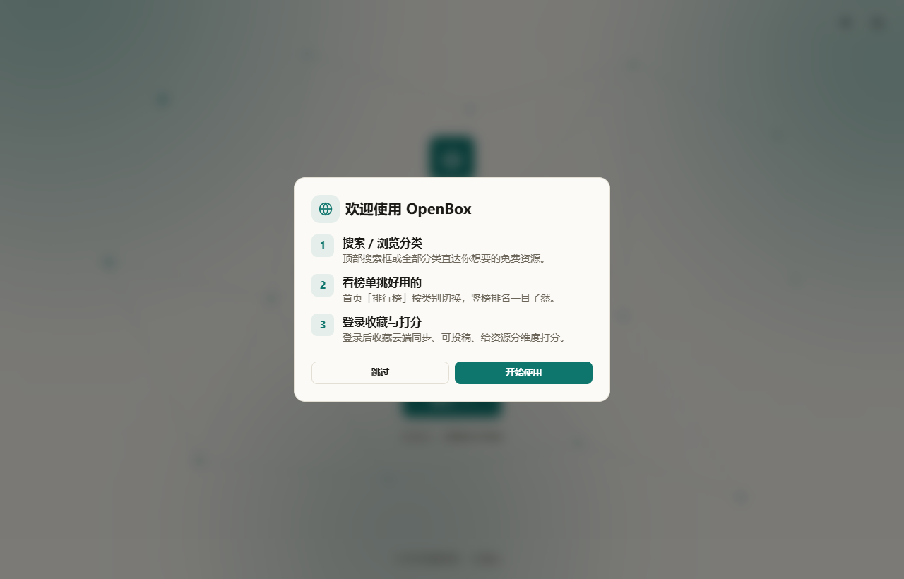
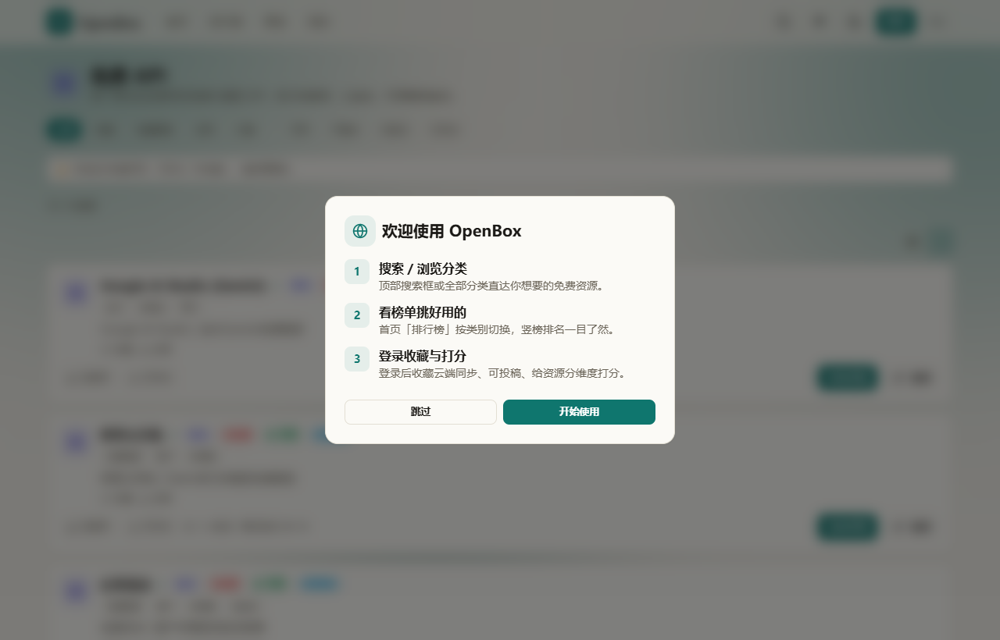

# OpenBox · 开源 AI 资源导航

<p align="center">
  
</p>

<p align="center">
  <strong>AI 时代免费资源，一处收录，随时直达</strong><br>
  280+ 精选资源 · 14 大分类 · 社区投稿 + 实跳验证 + 人工精选 · 三语界面
</p>

<p align="center">
  <a href="https://openbox-nav.pages.dev"><strong>🌐 在线体验</strong></a>
  ·
  <a href="https://github.com/Morningstar202604/OpenBox">GitHub</a>
  ·
  <a href="https://gitcode.com/badhope/OpenBox">GitCode</a>
  ·
  <a href="https://gitee.com/badhope/OpenBox">Gitee</a>
  ·
  <a href="https://a50a62f0345c835a5.app.workbuddy.link">🇨🇳 WB 国内通道</a>
</p>

<p align="center">
  
  
  
  
  
  
  
</p>

---

## 🎯 这是什么

OpenBox 是一个**社区化的内容型资源导航平台**——把 AI 时代**真正可用、可白嫖、可薅的资源**集中起来：免费 API、中转站、代理节点、免费服务器、免费域名、AI 应用、实用工具、学习资料、公益站、邀请码/激活码。

它不是站长一个人的作品——每条资源都来自**社区投稿 + 实跳验证 + 人工精选**三道闸门，任何人都可以投稿、投票、评论、上报失效。

## ✨ 为什么选 OpenBox

| 你遇到的痛点 | OpenBox 怎么解决 |
|---|---|
| 公益站 / 中转站过几天就失效 | 每月全量实跳审计 · 失效域名黑名单 · 资源状态标记 |
| 不知道某个站要邀请码、白名单还是绑卡 | 资源卡片明示「准入门槛」与 tips |
| GitHub 上一堆 awesome-list 但要啥找不到 | 14 大分类 + 5 场景交叉筛选 + 三语搜索 |
| 资源描述千篇一律、看不出真实情况 | 每条描述基于站内实测内容撰写 |
| 收藏的网站换个设备就没了 | 可选 Supabase 云同步，跨设备无缝 |
| 资源页面 UI 丑、广告满天飞 | 干净极简、三语、深夜模式、移动端原生体验 |

## 📦 内容构成

- 🧑‍🤝‍🧑 **社区投稿** — 站内「投稿」页，审核后展示
- ✅ **实跳验证** — 定期全量 HTTP 跳转验证，自动剔除死链
- ✍️ **人工精选** — 官方免费层、永久免费、稳定项目
- 🏷️ **门槛明示** — 邀请码 / 白名单 / 绑卡 / 境外网络全标清

## 🖼️ 看看里面长什么样

<p align="center">
  
</p>

> *免费 API 分类：35 个资源，每个都有「官方 / 免费 / 可用 / 海外」等标签，「还能用 / 已失效」社区投票一目了然。*

更多截图：[首页](screenshots/home.png) · [资源详情](screenshots/resource.png) · [全页演示](screenshots/home-full.png)

## ✨ 核心特性

- **280+ 精选资源 / 14 大分类**：免费 API / 免费聊天镜像 / 中转站 / 代理节点 / 免费服务器 / 免费域名 / AI 应用 / 实用工具 / 学习资料 / 公益站 / 邀请码激活码（系统软件 / 专业应用 / 手机软件 / 游戏 / 平台邀请），外加「小白白嫖 / 开发者 / 研究者 / 创作者 / 邀请码」五场景交叉筛选
- **社区验证投票**：每张卡片「👍 还能用 / ⚠ 已失效」+「N 人验证 · 最近验证 MM-DD」，匿名可投、云端共享、本地兜底
- **评论区**：每个资源一个轻量评论区，分享经验与避坑（匿名可留）
- **一键反馈**：卡片右上角 ⚠ 报告资源失效 / 链接错误，入库供审核
- **投稿审核**：投稿进审核库（pending → approved），URL 白名单校验 + 60s 提交冷却
- **登录 / 收藏（可选）**：配置 Supabase 后开启注册即登录，收藏上云跨设备同步
- **三语界面**（zh / en / ja）：分类名、界面、语录全三语，语言一键切换
- **双视图浏览**：网格卡 / 信息密集列表行，偏好本地记忆
- **移动端专属**：底部 Tab 导航、触控优化、safe-area 适配，不压缩桌面布局
- **品牌过渡**：1.5s 路由切换 / 2.8s 进站圆形光环 + Logo + 随机语录
- **SEO 就绪**：动态标题、OG / Twitter 卡片、JSON-LD 结构化数据、sitemap / robots
- **PWA**：可安装到桌面 / 手机，离线访问已部署页

## 🧱 技术栈

| 层 | 选型 |
|---|---|
| 框架 | React 19 + TypeScript（严格模式） |
| 构建 | Vite 8（本地 `base: /OpenBox/` 产 `docs/` 供 GitHub Pages 预览；CI 经 GitHub Actions 以 `base=/` 构建 `dist/` 直传 Cloudflare Pages 根域 `openbox-nav.pages.dev`） |
| 样式 | Tailwind CSS v4（`@theme` 语义令牌 + `.dark` 覆写） |
| 状态 | Zustand + `persist`（主题 / 收藏 / 提示 / 语言 / 会话） |
| 路由 | 原生 Hash 路由（无需服务端） |
| 后端 | Supabase BaaS（**可选**，默认本地种子兜底） |
| 图标 | lucide-react |

## 🚀 快速开始

```bash
git clone https://github.com/Morningstar202604/OpenBox
cd OpenBox
npm install --legacy-peer-deps
npm run dev        # 开发服务器 http://localhost:5173/OpenBox/
npm run build      # tsc -b && vite build（默认 base /OpenBox/ 输出 docs/ 供本地/GH Pages 预览；CI 用 VITE_BASE_URL=/ VITE_BUILD_DIR=dist 构建直传 Cloudflare Pages）
npm run preview    # 本地预览
```

> ⚠️ 项目 `base` 为 `/OpenBox/`，开发 / 预览均需通过 `/OpenBox/` 路径访问。

## 🗂️ 项目结构

```
src/
├─ main.tsx                 # 入口（ErrorBoundary + App）
├─ App.tsx                  # 路由 + 全局布局 + 过渡加载层 + 动态标题
├─ index.css                # 设计系统（令牌 / 组件类 / 关键帧动画）
├─ components/              # 通用组件（NavBar / ResourceCard / ResourceRow / FeaturedCard /
│                           #  PageLoader / MobileTabBar / VerifyWidget / CommentsWidget ...）
├─ pages/                   # 页面（10 个）
├─ store/                   # Zustand 状态
├─ hooks/                   # 路由 hooks
├─ i18n/                    # 三语字典（zh / en / ja）+ 站点语录池
├─ lib/                     # 数据模型 / 访问层 / 校验
└─ data/
   ├─ taxonomy.ts           # 分类单一数据源
   ├─ curated.ts            # 190+ 条社区精选
   ├─ sites.ts / seed.ts    # 旧数据映射 + 存活白名单
   └─ weekly.ts             # 每周更新
supabase/migrations/        # RLS 安全的 SQL（0001 基础表 / 0002 验证投票表 / 0003 评论表 / … / 0008 契约收编与 RLS 收口，共 0001–0008）
.github/                    # Issue / PR 模板
screenshots/           # README 演示截图
```

## 🔌 接入 Supabase（可选）

本地种子即可完整运行。启用云后端（投稿审核 / 登录 / 云端收藏 / 反馈 / 投票 / 评论）：

1. 在 [Supabase](https://supabase.com) 新建项目
2. SQL Editor 依次执行 `supabase/migrations/0001_init.sql` → `0002_verifications.sql` → `0003_comments.sql` → … → `0008_contract_and_rls.sql`（当前共 0001–0008，含验证投票 / 评论 / 评分 / 投稿约束 / 列名与 RLS 收口等）
3. 复制 `.env.example` 为 `.env`，填入 `VITE_SUPABASE_URL` 与 `VITE_SUPABASE_ANON_KEY`（anon 可公开，受 RLS 保护；service_role 严禁入前端）
4. Authentication → Email 关闭「Confirm email」实现注册即登录

详见 [`SUPABASE_SETUP.md`](./SUPABASE_SETUP.md)。

## 🤝 参与贡献

OpenBox 是社区项目，**任何人都可以贡献，不需要会写代码**。详细规范见 [`CONTRIBUTING.md`](./CONTRIBUTING.md)。

- 📤 **投稿资源** — 站内「投稿」页或 [新建议题](https://github.com/Morningstar202604/OpenBox/issues/new?template=feature_request.md)
- 🗳️ **验证资源** — 薅到了投「还能用」、踩坑了投「已失效」——你的票直接更新社区状态
- 💬 **留言避坑** — 资源详情页评论区分享你的使用经验
- ⚠️ **报告问题** — 资源失效 / 链接错误 → [Bug 报告](https://github.com/Morningstar202604/OpenBox/issues/new?template=bug_report.md)
- 🌍 **翻译** — 三语界面，欢迎补充改进 zh / en / ja 文案
- 🧑‍💻 **代码** — Fork → 分支 → PR（参考 [PR 模板](.github/PULL_REQUEST_TEMPLATE.md)）
- 💡 **反馈建议** — 任何想法都可以开 Issue 讨论
- ⭐ **点亮 Star** — 如果这个项目对你有用，**右上角点 Star** 是最大的支持
- 📣 **分享给朋友** — 一句「AI 时代免费资源导航站」可能就是别人最需要的

## 🛡️ 安全 / 行为准则

- [SECURITY.md](./SECURITY.md) — 漏洞报告流程
- [CODE_OF_CONDUCT.md](./CODE_OF_CONDUCT.md) — 社区行为准则

## 📄 许可

[Apache License 2.0](https://www.apache.org/licenses/LICENSE-2.0) © Morningstar202604 — 允许商业使用、修改和分发，需保留版权与许可声明。

---

<p align="center">
  <sub>Built with care by <a href="https://github.com/Morningstar202604">@Morningstar202604</a> & <a href="https://github.com/Morningstar202604">@Morningstar202604</a> · Mirrored on <a href="https://gitcode.com/badhope/OpenBox">GitCode</a> & <a href="https://gitee.com/badhope/OpenBox">Gitee</a> · 如果觉得有帮助，欢迎 ⭐ Star 与 PR 🎉</sub>
</p>
